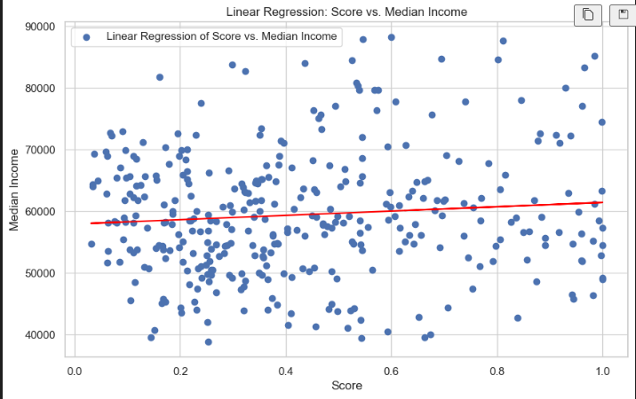
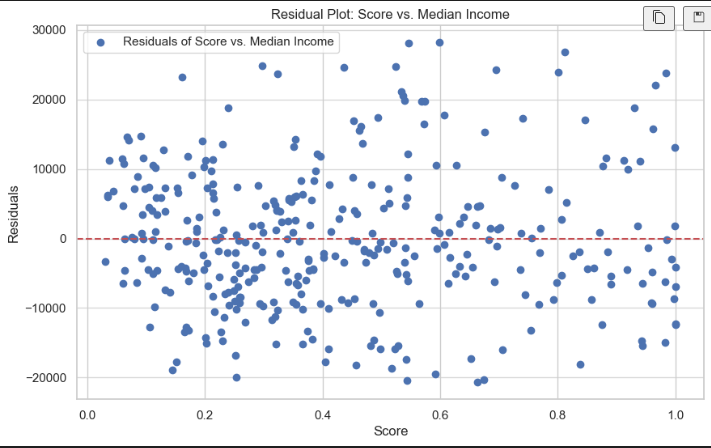
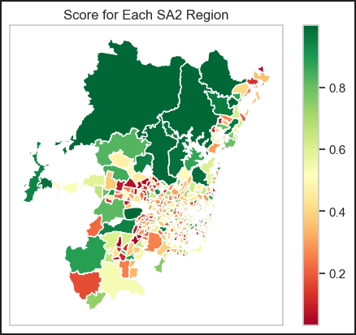
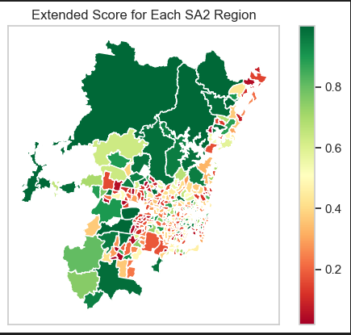
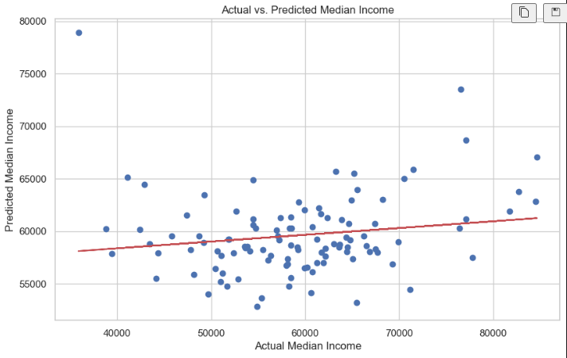

# Greater Sydney Analysis Report
The primary objective of this assignment is to develop a "bustling" metric for each SA2 region within Greater Sydney by spatially integrating multiple datasets. This metric aims to quantify the activity level in various districts, reflecting their social and economic vibrancy. Additionally, a linear regression model will be used to predict which dataset has the most significant impact on the bustling metric score, providing insights into the primary drivers of activity within each region.

## Table of Contents
1. [Dataset Imports and Database Description](#section-1)
2. [Definition and Feature Selection](#section-2)
3. [Extended Datasets and Results Analysis](#section-3)
4. [Rank-Based Scoring and Machine Learning](#section-4)
5. [Bibliography](#bibliography)

## 1. Dataset Imports and Database Description 

### 1.1 Datasets Imports

The datasets were imported into dataframes using Pandas and GeoPandas:

- **SA2 Regions**: Provided by the Australian Bureau of Statistics (ABS), containing geographical information about Statistical Area Level 2 (SA2) digital boundaries.
- **Businesses**: ABS dataset containing information about the number of businesses ordered by industry and SA2 regions.
- **Stops**: Locations of all public transport stops of trains and buses, provided by Transport NSW in GTFS format.
- **Polls**: Locations and details of polling places for the 2019 Federal election, provided by the Australian Electoral Commission.
- **Population**: Provided by the Australian Bureau of Statistics, this dataset contains regional population estimates by age and sex.
- **Income**: Provided by the Digital Atlas of Australia, this dataset includes income statistics, encompassing government allowances, by SA2 regions.

All datasets have been pre-cleaned and aggregated to facilitate easy import.

### 1.2 Database Description

After importing, the dataframes were processed, columns renamed, and null values handled. Dataframes were inserted into a normalized schema named "Greater_Sydney" with appropriate data types, primary keys, consistent naming conventions, and foreign keys. A detailed schema diagram is presented in the appendix.

## 2. Definition and Feature Selection 

### 2.1 Definition

To quantify "bustling" areas within Greater Sydney, the term is defined as areas demonstrating high traffic, robust economic activity, and high population density.

### 2.2 Feature Selection

- **Businesses**: Consumer services (e.g., Retail Trade, Accommodation and Food Services) and essential services (e.g., Administrative and Support Services) are considered.
- **Schools**: Combined primary, secondary, and future schools into a single table.
- **Stops and Polls**: Standardized metrics calculated per 1000 people.

### 2.3 Calculation

**Z-score Calculation**

$$Z = \frac{x - \mu}{\sigma}$$

**Bustling Score Calculation**

$$\text{Score} = S(z_{\text{consumer}} + z_{\text{others}} + z_{\text{polls}} + z_{\text{school}} + z_{\text{stops}})$$

Where $\mu$ is the mean, $\sigma$ is the standard deviation, and S is the sigmoid function.

### 2.4 Outliers Processing

An interquartile range (IQR) outlier threshold was applied, with a modified IQR multiplier of 5.5 for metropolitan areas.

## 3. Extended Datasets and Results Analysis 

### 3.1 Extended Datasets

Two additional datasets were added:

- **Building Approvals**: Insights into construction activity across SA2 regions.
- **Location Facilities**: Public transport accessibility data.

### 3.2 Results and Analysis

#### 3.2.1 Correlation Analysis

Weak positive correlation (approximately 0.07) between the "bustling" score and median income was found. 

  
  

<em>Figure 1: The linear model of “bustling” score and median income</em>

#### 3.2.2 Results

High "bustling" scores in areas like Sydney (North), Millers Point, Haymarket, Parramatta, and Surry Hills. Heatmap results aligned with expectations.

  
  

<em>Figure 2: Heatmap of Greater Sydney illustrating "bustling" scores and extended scores.</em>

#### 3.2.3 Limitations

The scoring function, while useful, is limited in accuracy due to the narrow scope of factors considered.

## 4. Rank-Based Scoring and Machine Learning 

### 4.1 Rank-Based Scoring

Implemented a rank-based system, normalizing and inverting ranks for each region's attributes. Final score calculated by averaging the sum of inverted ranks.

### 4.2 Machine Learning - Supervised Linear Regression

Linear regression model was fitted to predict median income, showing a weak overall fit. Multicollinearity issues identified among predictor variables.

  

<em>Figure 3: Scatter Plot of Actual vs. Predicted Median Income</em>

## Bibliography

1. [Australian Bureau of Statistics: Digital boundary files](https://www.abs.gov.au/statistics/standards/australian-statistical-geography-standard-asgs-edition-3/jul2021-jun2026/access-and-downloads/digital-boundary-files)
2. [Australian Bureau of Statistics: Counts of Australian Businesses](https://www.abs.gov.au/statistics/economy/business-indicators/counts-australian-businesses-including-entries-and-exits/latest-release)
3. [Open Data: Timetables Complete GTFS](https://opendata.transport.nsw.gov.au/dataset/timetables-complete-gtfs)
4. [Aurin: AEC - Federal Election - Polling Places (Point) 2019](https://data.aurin.org.au/dataset/au-govt-aec-aec-federal-election-polling-places-2019-na)
5. [NSW Government: School intake zones](https://data.cese.nsw.gov.au/data/dataset/school-intake-zones-catchment-areas-for-nsw-government-schools)
6. [Australian Bureau of Statistics: Regional population by age and sex](https://www.abs.gov.au/statistics/people/population/regional-population-age-and-sex/latest-release#data-downloads)
7. [Digital Atlas of Australia: ABS Income (including government allowances) by SA2](https://digital.atlas.gov.au/datasets/digitalatlas::abs-income-including-government-allowances-by-2021-sa2/about)
8. [Australian Bureau of Statistics: Building Approvals, Australia](https://www.abs.gov.au/statistics/industry/building-and-construction/building-approvals-australia)
9. [Open Data: Location facilities](https://opendata.transport.nsw.gov.au/dataset/25f006fd-d0fb-4a8e-bfda-7ea4033c1aeb/resource/e9d94351-f22d-46ea-b64d-10e7e238368a)
